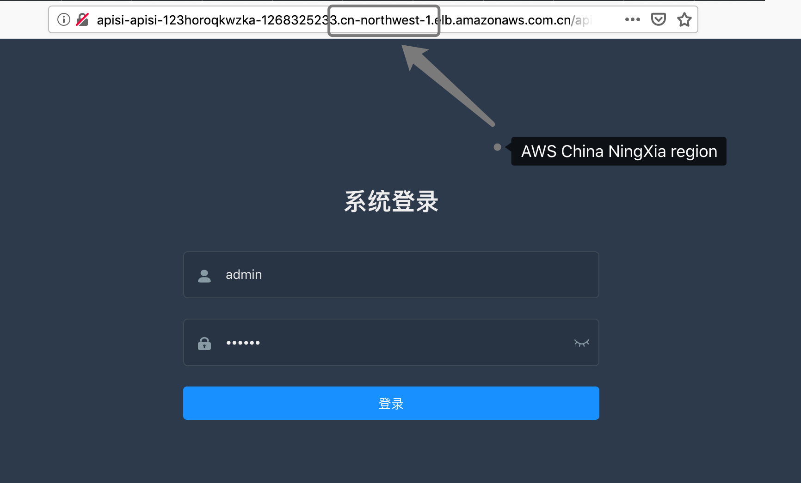

# Running APISIX in AWS

[APISIX](https://github.com/iresty/apisix) is a cloud-native microservices API gateway, delivering the ultimate performance, security, open source and scalable platform for all your APIs and microservices. 


## Architecture

This reference architecture walks you through building **APISIX** as a serverless container API Gateway on top of AWS Fargate with AWS CDK.


## Prerequisities for AWS CDK


## Deploy the APISIX Stack with AWS CDK

```bash
$ cd typescript
# compile the ts to js
$ npm run build
$ cdk --app bin/apisix.js deploy -c region=us-west-2
```

On deployment complete, some outputs will be returned:

```bash
Outputs:
apiSix.PhpServiceLoadBalancerDNS5E5BAB1B = apiSi-PhpSe-FOL2MM4TW7G8-09029e095ab36fcc.elb.us-west-2.amazonaws.com
apiSix.ApiSixDashboardURL = http://apiSi-ApiSi-1TM103DN35GRY-1477666967.us-west-2.elb.amazonaws.com/apisix/dashboard/
apiSix.ApiSixServiceLoadBalancerDNSD4E5B8CB = apiSi-ApiSi-1TM103DN35GRY-1477666967.us-west-2.elb.amazonaws.com
apiSix.ApiSixServiceServiceURLF6EC7872 = http://apiSi-ApiSi-1TM103DN35GRY-1477666967.us-west-2.elb.amazonaws.com
```

Open the `apiSix.ApiSixDashboardURL` from your browser and you will see the login prompt.

### Configure the upstream nodes

All upstream nodes are running as **AWS Fargate** tasks and registered to the **NLB(Network Load Balancer)** exposing multiple static IP addresses. We can query the IP addresses by **nslookup** the **apiSix.PhpServiceLoadBalancerDNS5E5BAB1B** like this:

```bash
$ nslookup apiSi-PhpSe-FOL2MM4TW7G8-09029e095ab36fcc.elb.us-west-2.amazonaws.com
Server:         192.168.31.1
Address:        192.168.31.1#53

Non-authoritative answer:
Name:   apiSi-PhpSe-FOL2MM4TW7G8-09029e095ab36fcc.elb.us-west-2.amazonaws.com
Address: 44.224.124.213
Name:   apiSi-PhpSe-FOL2MM4TW7G8-09029e095ab36fcc.elb.us-west-2.amazonaws.com
Address: 18.236.43.167
Name:   apiSi-PhpSe-FOL2MM4TW7G8-09029e095ab36fcc.elb.us-west-2.amazonaws.com
Address: 35.164.164.178
Name:   apiSi-PhpSe-FOL2MM4TW7G8-09029e095ab36fcc.elb.us-west-2.amazonaws.com
Address: 44.226.102.63
```

Configure the IP addresses returned as your upstream nodes in your **APISIX** dashboard followed by the **Services** and **Routes** configuration. Let's say we have a `/index.php` as the URI for the first route for our first **Service** from the **Upstream** IP adddresses.


## Validation

OK. Let's test the `/index.php` on `{apiSix.ApiSixServiceServiceURL}/index.php`


Now we have been successfully running **APISIX** in AWS Fargate as serverless container API Gateway service.

## Clean up

```bash
$ cdk destroy apiSix -c region=us-west-2
```


## Running APISIX in AWS China Regions

update the `typescript/lib/apisix.ts`

```js
  taskDefinition
    .addContainer('etcd', {
      image: ContainerImage.fromRegistry('gcr.azk8s.cn/etcd-development/etcd:v3.3.12'),
      // image: ContainerImage.fromRegistry('gcr.io/etcd-development/etcd:v3.3.12'),
    })
    .addPortMappings({
      containerPort: 2379
    })
```
_(read [here](https://github.com/iresty/docker-apisix/blob/9a731f698171f4838e9bc0f1c05d6dda130ca89b/example/docker-compose.yml#L18-L19) for more reference)_

Make sure you run `npm run buld` to compile `typescript/lib/apisix.ts` to `typescript/lib/apisix.js` again.

And then, similarily, just `cdk deploy` it and specify your preferred AWS region in China.


```bash
# let's say we have another AWS_PROFILE for China regions called 'cn'
# make sure you have aws configure --profile=cn properly.
#
# deploy to NingXia region
$ cdk --app bin/apisix.js deploy --profile cn -c region=cn-northwest-1
# deploy to Beijing region
$ cdk --app bin/apisix.js deploy --profile cn -c region=cn-north-1
```
In the following case, we got the `Outputs` returned for **AWS Ningxia region(cn-northwest-1)**:

```bash
Outputs:
apiSix.PhpServiceLoadBalancerDNS5E5BAB1B = apiSi-PhpSe-1760FFS3K7TXH-562fa1f7f642ec24.elb.cn-northwest-1.amazonaws.com.cn
apiSix.ApiSixDashboardURL = http://apiSi-ApiSi-123HOROQKWZKA-1268325233.cn-northwest-1.elb.amazonaws.com.cn/apisix/dashboard/
apiSix.ApiSixServiceLoadBalancerDNSD4E5B8CB = apiSi-ApiSi-123HOROQKWZKA-1268325233.cn-northwest-1.elb.amazonaws.com.cn
apiSix.ApiSixServiceServiceURLF6EC7872 = http://apiSi-ApiSi-123HOROQKWZKA-1268325233.cn-northwest-1.elb.amazonaws.com.cn
```

Open the `apiSix.ApiSixDashboardURL` URL and log in to configure your **APISIX** in AWS China region.




_TBD_

## Decouple APISIX and etcd3 on AWS

For high availability and state consistency consideration, you might be interested to decouple the **etcd3** as a seperate cluster from **APISIX** not only for performance but also high availability and faught tolerance yet with highly reliable state consistency.

_TBD_